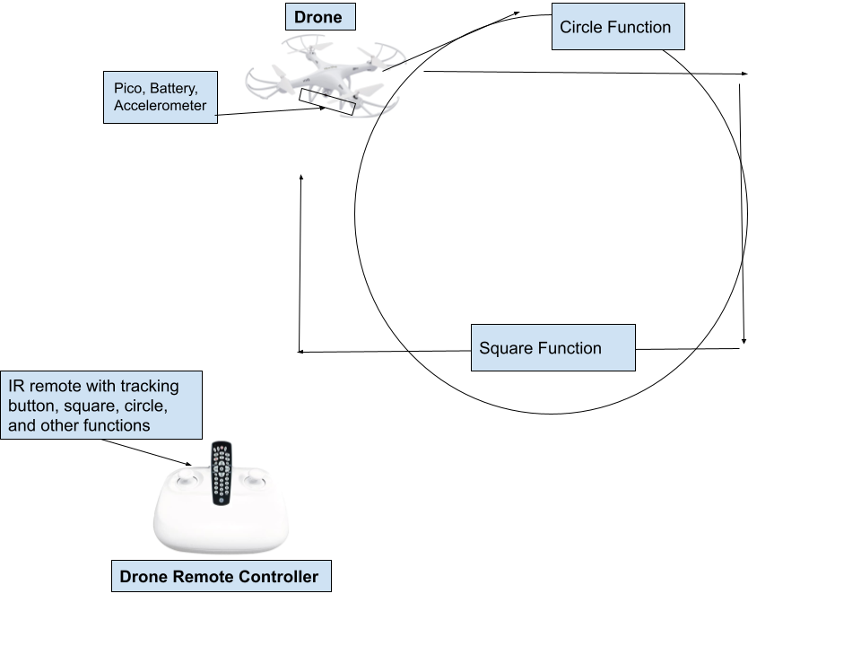

# Drone_In_The_Sky

&nbsp;

## Table of Contents
* [Planning](#Planning)

## Planning

### Materials 

 - Cheerwing Drone - CW4
 
 - Rasberry Pi
 
 - Breadboard
 
 - Wires 
 
 - Accelerometer 

 - Box to hold onboard pico
 
 - Laser cut fastening pieces
 
 - IR Remote 
 
### Images 

 

### Primary goal then following iterations 

### What we need to learn

### Schedule

