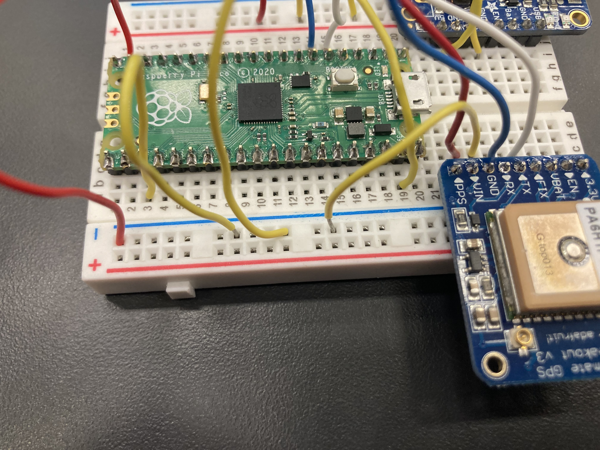

# Drone_In_The_Sky

&nbsp;

## Table of Contents
* [Planning](#Planning)
* [Week 1-4](#Weeks_1-4)
* [Week 4-10](#Weeks_4-10)


## Planning

### Materials 

 - Tello Quadcopter Drone
 
 - Tello Battery
 
 - Rasberry Pi - 6 grams
 
 - [Ultimate GPS](https://learn.adafruit.com/adafruit-ultimate-gps/circuitpython-python-uart-usage) - 8.5 grams
 
 - Circuitboard - 10 grams
 
 - Wires 

 - Attachment device to hold onboard pico
 
 - Laser cut/3D printed fastening pieces

 - LiPo battery + Powerboost 500c Module - 14 grams
 
 - [LORA](https://www.adafruit.com/product/3072) - 3.1 grams
 
### Images 

  

### Primary goal then following iterations 

Primary Goal - 

Use GPS with the Ultimate GPS tracker and a Pico to track a drone and display its path on a live map. 

Iterations - 
 - Add a switch to alter when the pico is in read-only or write-only mode
 
 - Make it send data in real time

 - Make a drone

 - Adding the button to turn the tracker on and off. Have a IR remote attached to the drone remote that controls when the PICO is drawing on the phone screen and when it isn't

Risk Mitigation - 

 - Hit someone with projectile/drone
 
 - Lose the GPS tracker if it doesn't work
  
 - Propeller blades can cause harm 
 
 - Muscular injury from walking to get drone or other projectile

Avoidance - 

We will wear safety glasses while flying the drone and doing other various tasks that could endanger our eyes. Properly warm-up before retrieving drone/projectile. 

### What we need to learn

 - How to add bluetooth to a pico
 
 - How to track distance using a pico 

 - How to map out a path on the screen from data
 

### Schedule

Weeks 1 and 2: We will complete the planning document besides code and cad sketches, schedule, and get permission. </br>
Week 3: We will complete pseudocode and CAD sketches of each part, and purchase/collect supplies. </br>
Weeks 4 and 5: We will start drafting the real code and CAD for printing, as well as wiring. </br>
Week 6: Complete process of connecting Pico to phone application and figure out display method. </br>
Week 7: Combine all components into full project for testing. </br>
Week 8: First Prototype test of flight, just tracking location and mapping. </br>
Week 9 and 10: Fix issues with code/flight. </br>
Week 11: Retest with new changes. </br>
Week 12: Implement new functions and test. </br>
Week 13 and 14: Finalize documentation and design.


## Weeks_1-4

During these weeks we completed the planning document and slowly finalized/revised our project until we decided on what our first, reasonable iteration would be. We then completed the PseudoCode and CAD design for the project.

### PseudoCode

 - Initialize Ultimate GPS module

 - Connect Google maps to PC

 - Connect to Ultimate GPS to Pico

 - Track Projectile while being flown

 - Data is converted to positioning on map

 - Automate Drawing Lines between data points

 - Send images to mobile device

 - Print data 

### CAD 

For this assignment we needed to attach the GPS tracker onto a tello drone so we are able to attach it. We used a previous CAD design that was meant to hold an egg over a tello and then remodeled it to hold the circuitboard, Rasberry Pi PICO, battery, and Adafruit Ultimate GPS. A major object in this project was keeping the total mass of the required modules as well as the printed CAD attachment under the tello weight restriction of 60 grams. We ended up acheiving this by cutting slits in the CAD design to cut down the weight. 


 

 


[CAD Link](https://cvilleschools.onshape.com/documents/748b0624d922708572d6db59/w/4d4ce83156b394ee96ab4f9d/e/5392185db1c275d61a384980)

### Code 

[Initial Code](Raspberry-Pi/Code_1.py)


## Weeks_4-10 

### Schedule

Week 4(1/30): Finish and print finalized CAD design then assemble. Start Coding. </br>  
Week 5(2/6): Coding. </br>
Week 6(2/13): Coding. </br>
Week 7(2/20): Test finalized code with bread board. </br>
Week 8(2/27): Solder the board with finalized components and assemble with attachment. </br> 
Week 9(3/3): Combine all components into full project for testing. </br>
Week 10(3/10): First Prototype test of flight with all components. Logging location. </br>

### Finalized CAD 

One major change we made in our CAD design was adding slits in the battery holder to save weight and also editing the dimensions for a more snug fit. We also added a nut shaped extrude in the bottom of the attachment to hold the nut alling the bolt to screw in because the bolt was not long enough to reach all the way through. 

 


 


 


[CAD Link](https://cvilleschools.onshape.com/documents/748b0624d922708572d6db59/w/4d4ce83156b394ee96ab4f9d/e/7e351361971f75975efdfd49)

### Code explained

#### <ins>GPS tracker</ins>
To start the code off, we used the basic starter code on the GPS module website, linked [here.](https://learn.adafruit.com/adafruit-ultimate-gps/circuitpython-python-uart-usage)

Here are some important lines:

```python
import adafruit_gps
uart = busio.UART(board.GP4, board.GP5, baudrate=9600, timeout=10)
gps = adafruit_gps.GPS(uart, debug=False) 
 
```
After we copy and pasted this starter code, we began to dissect it and remove the portions we didn't need. The main two items necessary for our project are latitude and longitude, so we kept those and removed the rest.

#### <ins>Data storage</ins>
Next, we needed to figure out how to write data onto our pico, so that the drone could store the longitude and latitude values. The Raspberry Pi Pico can either read data or write data, and in write-only mode, the user is unable to edit any files on the pico. This turned out to be extremely annoying, as each time a problem occured in our code, we had to reboot the device into read-only mode, fix the problem, then reboot again into write-only.
Instructions can be found [here.](https://learn.adafruit.com/cpu-temperature-logging-with-circuit-python/writing-to-the-filesystem) 

##### <ins>Creating a boot file</ins>

It took a while to figure out how to switch back and forth efficiently, but we managed to create a boot file that checks whether a wire is grounded. If it is, then the pico boots into write mode; if not, then it goes into read only mode.

```python
import board
import digitalio
import storage

switch = digitalio.DigitalInOut(board.GP15)
switch.direction = digitalio.Direction.INPUT
switch.pull = digitalio.Pull.UP

if not switch.value:
    storage.remount("/", readonly=False)
```
We saved this file as [boot.py](Raspberry-Pi/boot.py) on the pico. When the pico is restarted, it will automatically boot into this file. Now we won't have to use the terminal to switch between write and read mode each time, and can simply ground or unground the wire. 

Note -  if you ever get stuck in read-only mode, use the terminal to rename the boot file from "boot.py" to "boot.bak"
 
 Type the following three lines into the terminal, and then reboot the device:
```python
 import os
 os.listdir("/")
 os.rename("/boot.py", "/boot.bak")
 ```

##### <ins>Data write test</ins>

After we were done setting up the switch wire, we were set to test the actual data collection. As a simple proof of concept, we created the following test file to see if the pico's data storage worked correctly. This file could also be used as a tool to mess with the formatting of the data before it's written, so that we didn't have to get a fix each time we wanted to see how the data is written.

```python
[x1, y1] = input("Enter coordinate 1: ").split(",")                 # Takes an input of 2 integers using the split method
[x2, y2] = input("Enter coordinate 2: ").split(",")
[x3, y3] = input("Enter coordinate 3: ").split(",")

data = [[x1, y1], [x2, y2], [x3, y3]]                               # Arranges the data on a list

with open("/testVars.txt", "a") as fp:                              # Opens a new text file on the pico titled "testVars"
    for i in range(len(data)):                                      # Loops through the data
        fp.write(f'{data[i][0]}, {data[i][1]}\n')                   # and writes each data point onto the file
        fp.flush()
        led.value = not led.value                                   # Turns the onboard led to the opposite state 
                                                                    # to test delay time of each write
```

#### <ins>Datalog v 1.0</ins>

Finally, we coded the device to collect actual gps data and save it onto a text file on the Pico. We did this by combining all of the above with the base data collection code given by the [Ultimate GPS](https://learn.adafruit.com/adafruit-ultimate-gps/circuitpython-python-uart-usage) website manual:

```python
with open("/gps2.txt", "a") as textFile: # Creates a txt file on the pico (adds to it if it already exists) called "gps2".
    while True:
        update = gps.update()    # Every second print out current location details if there's a fix.
        if not gps.has_fix:      # Try again if we don't have a fix yet.
            print("Waiting for fix...")
            time.sleep(.5)
            continue
        else:
            if update:   
                textFile.write(f'{gps.latitude}, {gps.longitude}\n')   # Neatly formats the latitude and longitude and writes it onto the text file 
                textFile.flush()  # Flushes the working memory of the device after the data is saved.

```
See [Version 1](Raspberry-Pi/DatalogV1.py) code for full working code...


##### <ins>Issues</ins>

* Data was collected with repeating values, so if the system did not move, it collected the same latitude and longitude values.

#### <ins>Version 2 (final code)</ins>

In order to fix the issue, we added a couple lines that save the previous value as a variable, and checks to make sure the previous value does not equal the current. If so, it does not save the value, and waits until it gets a new one:

```python

if update and ((prev_lat != gps.latitude) or (prev_long != gps.longitude)):
     textFile.write(f'{gps.latitude}, {gps.longitude}\n')
     textFile.flush()     
     
     prev_lat = gps.latitude
     prev_long = gps.longitude
```
There were a couple issues with this code, all very fixable:
1. The each time prev_lat was set to a new value, it was not necessarily equal to the current value. This was because it collected a new instance of value of gps.latitude or gps.longitude (it reupdated when the function was called). The reason this was a problem was because it often ran through the loop again even if the position was exactly the same. The fix to this was to set gps.latitude and gps. longitude to their own new variables, and then match the previous latitude and longitude to those:

```python
*insert fix

```
2. *Notation of not equals loop

Here is the final code - 

```python
import time
import board
import busio
import digitalio
import adafruit_gps

led = digitalio.DigitalInOut(board.LED)     # sets up LED in these 2 lines
led.direction=digitalio.Direction.OUTPUT 

uart = busio.UART(board.GP4, board.GP5, baudrate=9600, timeout=10) #
gps = adafruit_gps.GPS(uart, debug=False) 

prev_lat = 0.0
prev_long = 0.0


gps.send_command(b"PMTK314,0,1,0,1,0,0,0,0,0,0,0,0,0,0,0,0,0,0,0")
gps.send_command(b"PMTK220,500")


with open("/NEWWORKTEST2.txt", "a") as textFile:
    while True:
        update = gps.update()
        # Every second print out current location details if there's a fix.

        if not gps.has_fix:
            # Try again if we don't have a fix yet.
            print("Waiting for fix...")
            time.sleep(.5)
            continue

        else:
            latitude = round(float(gps.latitude), 4)
            longitude = round(float(gps.longitude), 4)

            if update and not ((prev_lat == latitude) and (prev_long == longitude)):

                print(latitude)
                print(longitude)
                print(gps.timestamp_utc.tm_min)
                print(gps.timestamp_utc.tm_sec)
                print("-" * 40) 
                
                textFile.write(f'{latitude}, {longitude}\n')
                textFile.flush()
                    
                prev_lat = latitude
                prev_long = longitude

                led.value = True
                time.sleep(1)
                led.value = False
            else:
                print("-No new values-")
                
```


### Initial Test Wiring 

  

  


### Final Soldering/Wiring 

  
 

### Final CAD with board

  
 

### Data Mapping

After collecting a list of latitudes and longitudes we could then test the accuracy of the data using Google Earth Pro. GEP allows you to upload a text file and then maps the list of coordinates. The first test map we made was using a list with repeats and the data was not super accurate. 

 

After finalizing the code and being able to collect data without repeats, the next step is to map those points to decipher how accurate the data is. To do this,we walked a lap around the baseball field, right on the exterior fence, to have a reference point for the data. We then mapped it and the results are below. It had much less of a spread from the path and only mapped the path we walked, no extra points farther into the school than we went. 

 

